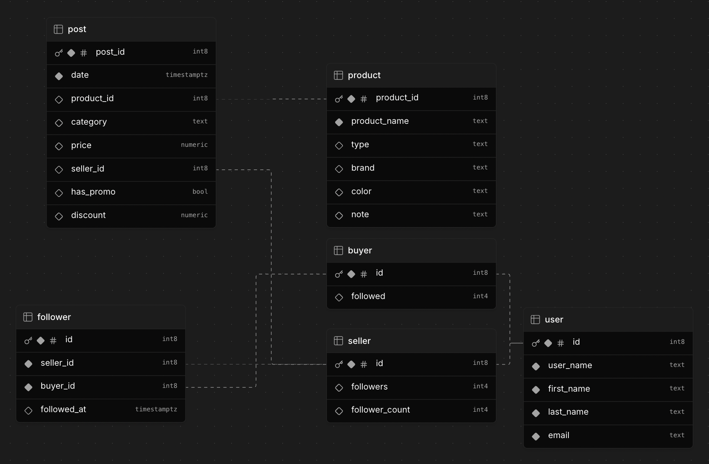

# SocialMeli
MercadoLibre's Java Backend Bootcamp - Wave #31 - Group 7

## About SocialMeli :question:
- [Project description](#project-description-bulb)
- [Documentation](#documentation-open_book)
- [Developers](#developers-bust_in_silhouette)

## Project description :bulb:
SocialMeli is a beta feature for Mercado Libre that enables buyers to follow their favorite sellers and stay updated with their latest posts. The project aims to create a more interactive and personalized shopping experience by strengthening the connection between buyers and sellers.

## Documentation :open_book:
* [Technical requirements](https://docs.google.com/document/d/1OhqUYn3Jrxv90CbTLpyjj91pOl5odvaR/edit?usp=sharing&ouid=103111917721801765291&rtpof=true&sd=true)

## Entity-relation diagram 🔗

## Developers :bust_in_silhouette:
* **Carolina Beatríz Seoane** - [CarolinaSeoane](https://github.com/CarolinaSeoane)
* **Delfina Tognolini** - [Delfina444](https://github.com/Delfina444)
* **Juan Martin Caparros** - [jcaparr](http://github.com/jcaparr)
* **Romina Platini** - [platiniromina](https://github.com/platiniromina)
* **Thomas Barenghi** - [thomasbarenghi](https://github.com/thomasbarenghi)
